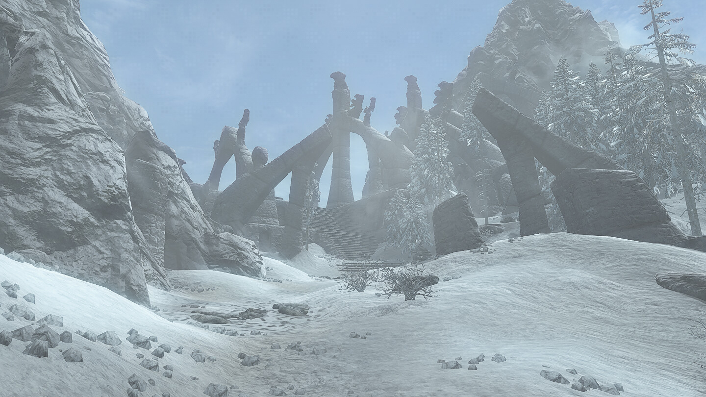

# About:  
This is Reshade preset that I created for Skyrim Anniversary Edition. The look can be described as slightly sharpened frostier deyellowed depinked vanilla :). The advantage or disadvantage of this preset is that it makes the game less yellow/pink and more blue (which is personal preference). It's meant to look very similar to original game so it can be used without thinking about it to much. Im playing the game with scaled resolution so the enhanced contrast is essential to me, but may be not that visible if you play Skyrim in native resolution.  
I created 3D LUT in .cube format for this preset using my image processing program from [here](https://github.com/Krzysztof-Bogunia/cherrypk_pixel_stacker.git). The process was basically comparing game screenshots with their versions "enhanced" in Darktable. I use it with modded game but some screenshots for color calibration were from base game so it should look similar. It's game independent so it may even work for other games that have ReShade integration.  

[TLDR] It's minimalistic Skyrim Reshade presets that sharpens the game and makes the colors colder.

# Requirements:
 * Reshade with BX-Shaders.  

# Examples before/after (modded Skyrim):  
For detailed comparison it's good to download images and switch between them in fullscreen view.  
|     BEFORE      |      AFTER     |
| :-------------: | :------------: |
|   |  |
|   |  |
|   |  |
|   |  |
|   |  |
|   |  |
|   |  |
|   |  |
|   |  |
|   |  |
|   |  |
|   |  |
|   |  |
|   |  |

# How to:  

## Installing full preset:  
1. Download latest preset (FDVanilla_Reshade.ini + reshade-shaders) from [releases](https://github.com/Krzysztof-Bogunia/FDVanilla_Reshade/releases).  
2. Extract downloaded files in main game folder.  
3. Launch Reshade menu in game and load FDVanilla_Reshade.ini as preset.  

## Installing only LUT:  
   
1. Download latest lut folder (reshade-shaders) from [releases](https://github.com/Krzysztof-Bogunia/FDVanilla_Reshade/releases).  
2. Extract downloaded files in main game folder.  
3. Launch Reshade menu in game and enable Cube LUT 3D with following settings:
 - CUBE_3D_SIZE = 65
 - SOURCE_CUBELUT3D_FILE = "FDVanilla_lut.cube"  
 - [optionally] change LUT intensity value  
  

# Supported platforms:  
I tested it on:  
* Windows 10, Reshade 6.4.1  
  
In case of black screen disabling community shaders can help. Sometimes I had some problems when using both Reshade and CS.
